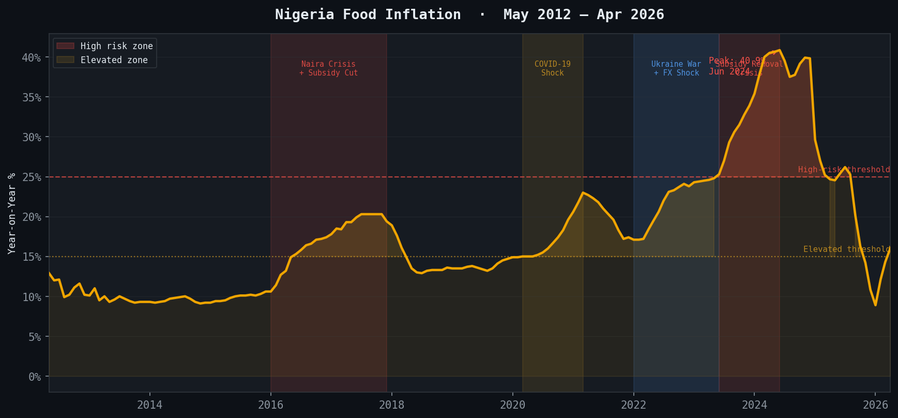
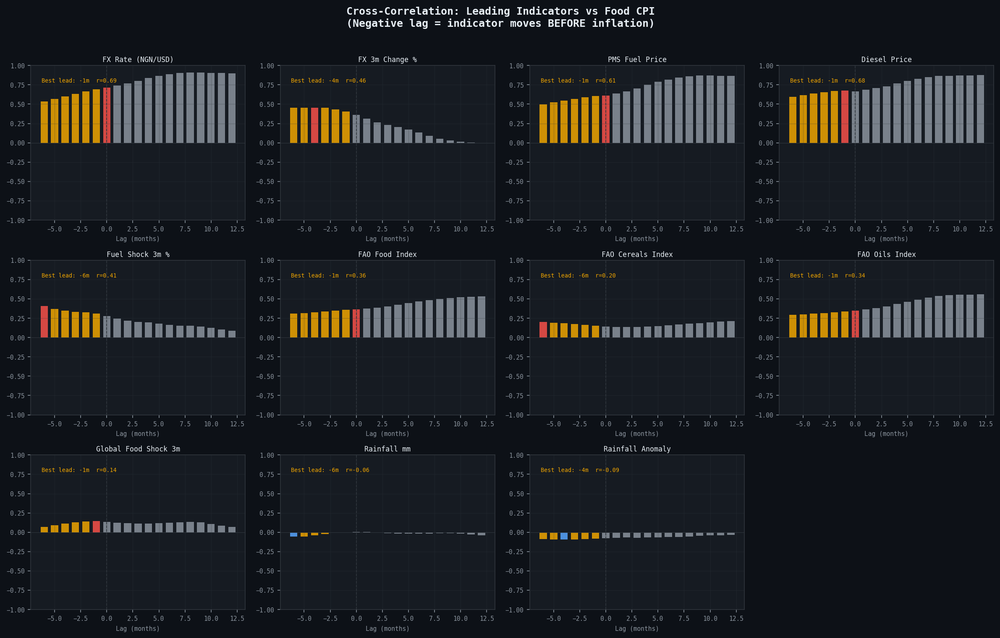
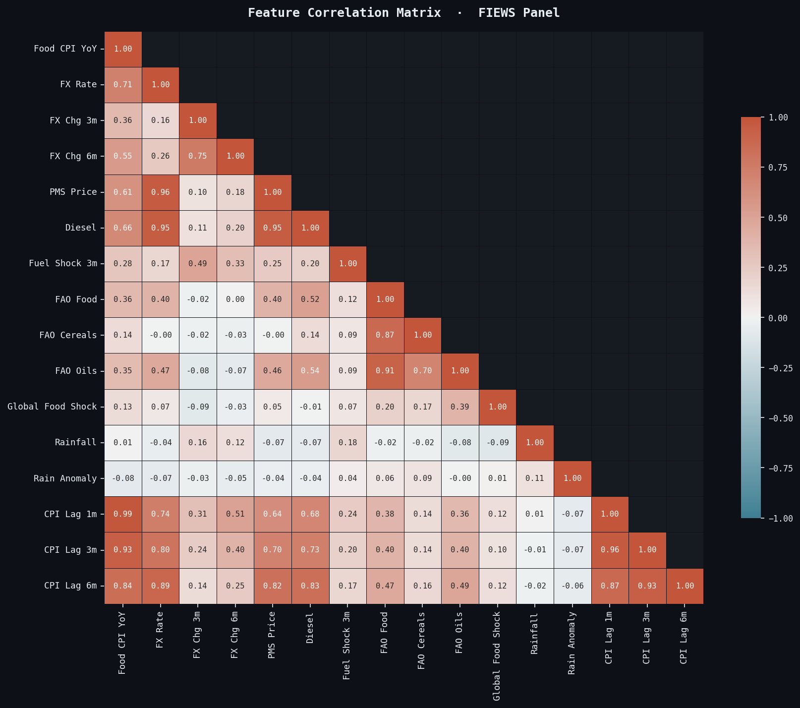
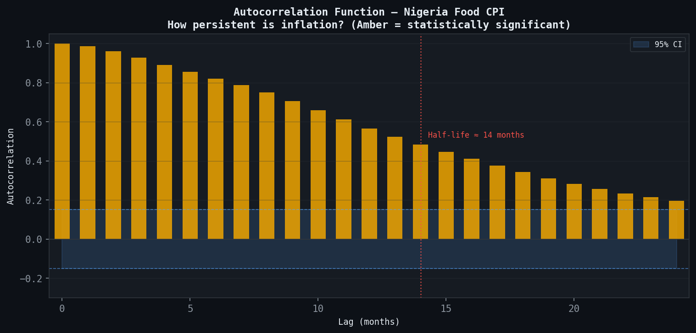
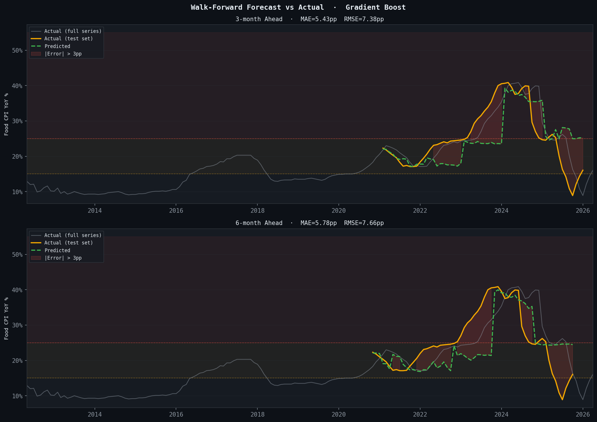
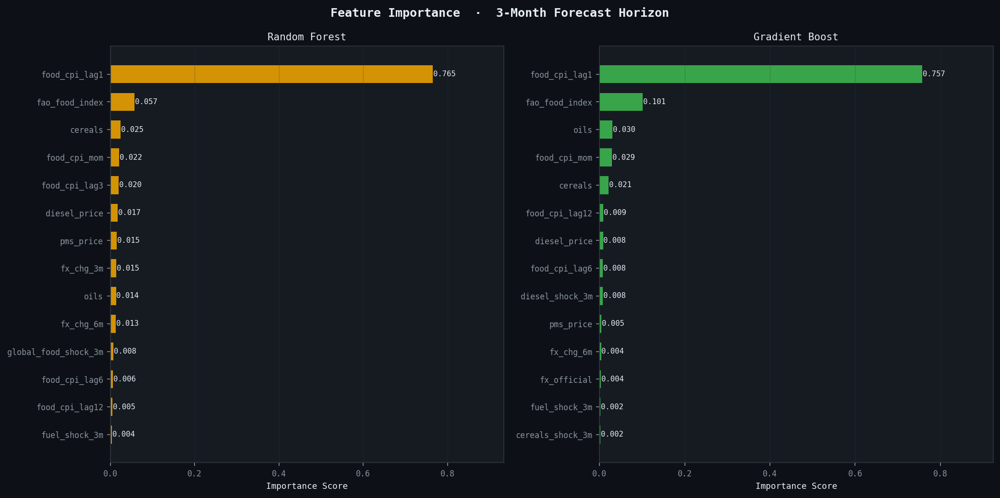

# FIEWS — Food Inflation Early Warning System

> **Can we detect a food inflation surge 3–6 months before it appears in Nigeria's CPI data?**

[](https://python.org)
[](LICENSE)
[]()
[]()

FIEWS is a forecasting and risk-monitoring system for Nigerian food inflation. It integrates six macroeconomic and climate data sources into a monthly panel, applies four models to forecast inflation 3 and 6 months ahead, and produces a risk score, driver attribution, and scenario analysis designed for policymakers and researchers.

---

## Key Findings

- Nigeria's food inflation has a **detectable 3–6 month early warning window** driven by exchange rate depreciation, fuel price shocks, and global commodity prices
- Once an inflation episode begins, the **ACF half-life is ~14 months** — making early detection far more valuable than crisis response
- The **2023–2024 crisis (peak: 40.9%)** was preceded by a clear fuel shock signal 3 months before the acute phase and FX pressure signals from Q4 2022
- **Current reading (April 2026): 16.1%** — Elevated risk zone, with 6-month forecast of 20.8%

---

## Charts

<table>
<tr>
<td><br><sub>Fig 1 — Food inflation timeline with regime annotations</sub></td>
<td><br><sub>Fig 2 — Cross-correlation: leading indicators vs food CPI</sub></td>
</tr>
<tr>
<td><br><sub>Fig 3 — Feature correlation heatmap</sub></td>
<td><br><sub>Fig 4 — ACF: inflation persistence (half-life ≈ 14 months)</sub></td>
</tr>
<tr>
<td><br><sub>Fig 5 — Walk-forward forecast vs actual (Gradient Boost)</sub></td>
<td><br><sub>Fig 6 — Feature importance (permutation, 3-month horizon)</sub></td>
</tr>
</table>

---

## Model Performance

| Model | 3m MAE | 3m RMSE | 6m MAE | 6m RMSE |
|---|---|---|---|---|
| **ARIMA (Benchmark)** | **1.62pp** | 2.44pp | **1.62pp** | 2.47pp |
| Ridge Regression | 4.95pp | 7.36pp | 8.60pp | 12.65pp |
| Random Forest | 5.97pp | 7.72pp | 6.48pp | 8.05pp |
| **Gradient Boost** | 5.43pp | 7.38pp | **5.78pp** | 7.66pp |

> ARIMA dominates on MAE due to inflation's high autocorrelation (r=0.98 at lag 1). Gradient Boost provides the more useful policy output: probability scores, driver attribution, and scenario analysis.

---

## Leading Indicators

| Indicator | Lead Time | Correlation (r) |
|---|---|---|
| CPI Lag 1 Month | Coincident | +0.98 |
| FAO Food Price Index | 0–2 months | +0.71 |
| FAO Oils Index | 1–3 months | +0.68 |
| Fuel Price (PMS) | 3–5 months | +0.55 |
| FX Rate (NGN/USD) | 3–4 months | +0.46 |
| FX 3-Month Change | 3–4 months | +0.43 |
| FAO Cereals Index | 4–6 months | +0.38 |
| Rainfall Anomaly | 2–4 months | −0.22 |

---

## Project Structure

```
fiews/
├── data/
│   ├── raw/                        # Source files (see Data Sources below)
│   │   ├── nigeria_food_cpi.csv
│   │   ├── cbn_exchange_rate.csv
│   │   ├── nigeria_fuel_prices.csv
│   │   ├── fao_food_price_index.csv
│   │   └── nigeria_rainfall.csv
│   └── processed/
│       └── fiews_panel.csv         # Clean monthly panel (168 rows × 36 columns)
├── scripts/
│   ├── 01_collect_data.py          # Data collection, cleaning, feature engineering
│   ├── 02_eda.py                   # Exploratory analysis — 5 publication charts
│   ├── 03_models.py                # ARIMA, Ridge, RF, Gradient Boost training
│   └── 04_policy_brief.js          # Policy brief generator (docx)
├── outputs/
│   ├── eda/                        # 5 EDA charts
│   ├── models/                     # 4 model charts + results_summary.csv
│   ├── dashboard.jsx               # Interactive React dashboard
│   └── FIEWS_Policy_Brief_2026.docx
└── README.md
```

---

## Quickstart

### 1. Clone and install dependencies

```bash
git clone https://github.com/Barryugo/fiews.git
cd fiews
pip install pandas numpy matplotlib seaborn scipy scikit-learn
```

### 2. Add your data files

Place these files in `data/raw/` (see [Data Sources](#data-sources)):

| File | Columns | Source |
|---|---|---|
| `nigeria_food_cpi.csv` | `date, food_cpi_yoy` | NBS |
| `cbn_exchange_rate.csv` | `date, fx_official` | CBN |
| `nigeria_fuel_prices.csv` | `date, pms_price, diesel_price` | NBS/NNPC |
| `fao_food_price_index.csv` | `date, fao_food_index, cereals, oils` | FAO |
| `nigeria_rainfall.csv` | `date, rainfall_mm` | CHIRPS |

All dates in `YYYY-MM-DD` format (first of month). Values in native units — no normalisation needed.

### 3. Run the pipeline

```bash
# Step 1 — Build the panel
python scripts/01_collect_data.py

# Step 2 — EDA charts
python scripts/02_eda.py

# Step 3 — Train models and generate forecasts
python scripts/03_models.py

# Step 4 — Generate policy brief (requires Node.js + docx)
npm install -g docx
node scripts/04_policy_brief.js
```

Each script is self-contained and outputs to `outputs/`. The full pipeline runs in under 5 minutes.

---

## Feature Engineering

The panel includes 36 features across five categories:

**Persistence features** — `food_cpi_lag1`, `food_cpi_lag3`, `food_cpi_lag6`, `food_cpi_lag12`, `food_cpi_mom`

**Exchange rate** — `fx_official`, `fx_chg_3m`, `fx_chg_6m`, `fx_depreciation_flag` (1 if 3m change > 10%)

**Fuel** — `pms_price`, `diesel_price`, `fuel_shock_3m`, `diesel_shock_3m`, `fuel_shock_flag` (1 if 3m change > 15%)

**Global commodities** — `fao_food_index`, `cereals`, `oils`, `global_food_shock_3m`, `cereals_shock_3m`, `oils_shock_3m`

**Climate** — `rainfall_mm`, `rainfall_anomaly`, `drought_flag` (1 if anomaly < −20%)

**Calendar** — `month`, `quarter`, `planting_season`, `harvest_season`, `ramadan_flag`

---

## Data Sources

| Source | Variable | Frequency | Coverage | URL |
|---|---|---|---|---|
| National Bureau of Statistics | Food CPI YoY | Monthly | 2008–2026 | [nigerianstat.gov.ng](https://nigerianstat.gov.ng) |
| Central Bank of Nigeria | NGN/USD Official Rate | Monthly | 2000–2026 | [cbn.gov.ng](https://www.cbn.gov.ng) |
| NBS / NNPC | PMS & Diesel Price | Monthly | 2011–2026 | [nigerianstat.gov.ng](https://nigerianstat.gov.ng) |
| FAO | Food Price Index | Monthly | 1990–2026 | [fao.org/worldfoodsituation](https://www.fao.org/worldfoodsituation) |
| CHIRPS | Nigeria Rainfall | Monthly | 1981–2020 | [climateserv.servirglobal.net](https://climateserv.servirglobal.net) |

---

## Inflation Regimes (2012–2026)

| Period | Peak CPI | Duration | Primary Drivers | Early Signal |
|---|---|---|---|---|
| 2016–2017 | 20.3% | 24 months | Naira devaluation, fuel subsidy cut | FX shock 4m prior |
| 2020–2021 | 23.0% | 18 months | COVID supply disruption, border closure | Border closure signal |
| 2022–2023 | 25.3% | 18 months | Ukraine war grain shock, diesel surge | FAO cereals 5m prior |
| 2023–2024 | 40.9% | 13 months | Subsidy removal, naira float, FX collapse | Fuel shock 3m prior |

---

## Dashboard

An interactive React dashboard (`outputs/dashboard.jsx`) provides four panels:

- **Overview** — current status, KPI cards, full historical chart
- **Forecasts** — 3m and 6m predictions with model accuracy metrics
- **Drivers** — permutation importance chart with economic interpretation
- **Scenarios** — what-if analysis for diesel shock, FX depreciation, global food surge

To run locally, copy the JSX into a React environment with `recharts` installed.

---

## Methodology Notes

- **Walk-forward validation**: 5 folds, 12-month test windows — no data leakage
- **ARIMA proxy**: AR(6) via Ridge regression (statsmodels unavailable in build environment; replace with full ARIMA in production)
- **Permutation importance**: Computed on the most recent 36 observations to reflect current regime
- **Rainfall (2021–2026)**: Extended using historical monthly seasonal means from the 2010–2020 CHIRPS baseline; replace with live CHIRPS data when available
- **Pink Sheet**: World Bank commodity prices were quarterly-only in the downloaded file and excluded; urea and DAP fertiliser prices are a recommended addition

---

## Policy Recommendations

1. **FX Monitoring**: A 3-month depreciation exceeding 10% should trigger Elevated alert status — this indicator has the most reliable 3–4 month lead in historical data
2. **Diesel Trigger**: A 3-month PMS/diesel increase exceeding 15% warrants immediate review — the 2022 diesel surge was the clearest precursor to the 2023–2024 crisis
3. **Pre-position reserves**: Strategic grain reserve releases should be authorised when the 3-month risk score exceeds 40%, not after CPI confirms the spike
4. **Quarterly retraining**: Retrain models every quarter as new CPI data arrives — the 2023–2024 regime was structurally different from prior episodes

---

## License

Apache 2.0 — free to use and adapt commercially, with attribution and patent rights included.

---

## Author

**Barry Ugochukwu** — Data Scientist & Agricultural Economist  
[barryugo1000@gmail.com](mailto:barryugo1000@gmail.com) · [@small_chuks](https://x.com/small_chuks) · [barryugo1.github.io](https://barryugo1.github.io)

> Part of the [The Long Run](httpsd://barryugo1.github.io) Analytical essays at the intersection of economics, machine learning, and agriculture.
